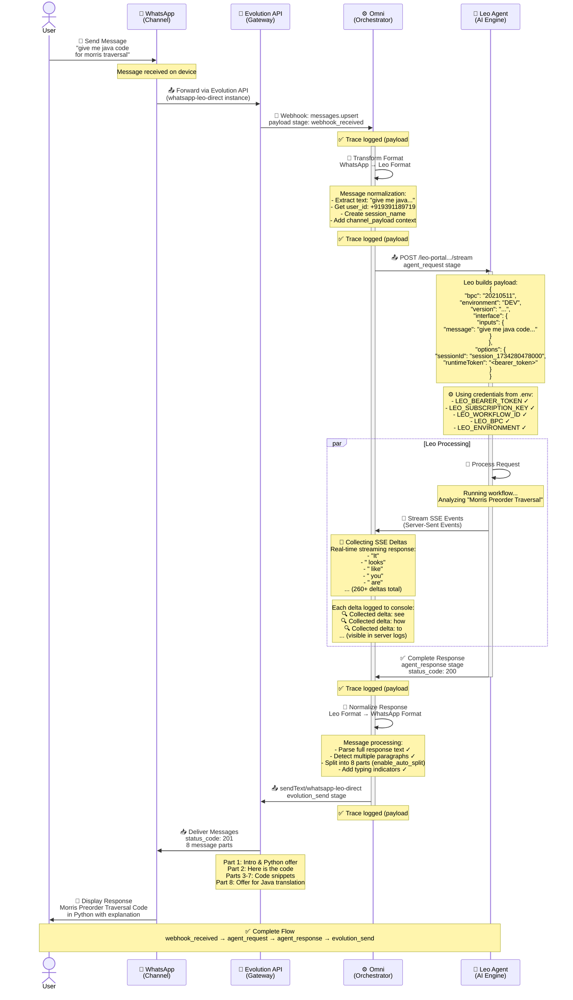

```mermaid
sequenceDiagram
    actor User
    participant WhatsApp as 📱 WhatsApp<br/>(Channel)
    participant Evolution as 🔄 Evolution API<br/>(Gateway)
    participant Omni as ⚙️ Omni<br/>(Orchestrator)
    participant Leo as 🤖 Leo Agent<br/>(AI Engine)

    %% Stage 1: Message from WhatsApp
    User->>WhatsApp: 📨 Send Message<br/>"give me java code<br/>for morris traversal"
    
    Note over WhatsApp: Message received on device
    
    WhatsApp->>Evolution: 📤 Forward via Evolution API<br/>(whatsapp-leo-direct instance)
    
    %% Stage 2: Webhook Received by Omni
    Evolution->>Omni: 🔔 Webhook: messages.upsert<br/>payload stage: webhook_received
    
    Note over Omni: ✅ Trace logged (payload #302)<br/>Format:<br/>{<br/>  "key": {"remoteJid": "919391..."},<br/>  "message": {<br/>    "conversation": "give me java..."<br/>  }<br/>}
    
    activate Omni
    
    %% Stage 3: Omni Prepares Agent Request
    Omni->>Omni: 🔄 Transform Format<br/>WhatsApp → Leo Format
    
    Note over Omni: Message normalization:<br/>- Extract text: "give me java..."<br/>- Get user_id: +919391189719<br/>- Create session_name<br/>- Add channel_payload context
    
    Note over Omni: ✅ Trace logged (payload #303)<br/>Format:<br/>{<br/>  "agent_name": "leo",<br/>  "message_content": "[Pavan]: give me...",<br/>  "session_name": "whatsapp-leo...",<br/>  "user": {<br/>    "phone_number": "+919391189719"<br/>  }<br/>}
    
    %% Stage 4: Agent Request
    Omni->>Leo: 📤 POST /leo-portal.../stream<br/>agent_request stage
    
    activate Leo
    
    Note over Leo: Leo builds payload:<br/>{<br/>  "bpc": "20210511",<br/>  "environment": "DEV",<br/>  "version": "...",<br/>  "interface": {<br/>    "inputs": {<br/>      "message": "give me java code..."<br/>    }<br/>  },<br/>  "options": {<br/>    "sessionId": "session_1734280478000",<br/>    "runtimeToken": "<bearer_token>"<br/>  }<br/>}
    
    Note over Leo: ⚙️ Using credentials from .env:<br/>- LEO_BEARER_TOKEN ✓<br/>- LEO_SUBSCRIPTION_KEY ✓<br/>- LEO_WORKFLOW_ID ✓<br/>- LEO_BPC ✓<br/>- LEO_ENVIRONMENT ✓
    
    %% Stage 5: Agent Processing (SSE Streaming)
    par Leo Processing
        Leo->>Leo: 🧠 Process Request
        Note over Leo: Running workflow...<br/>Analyzing "Morris Preorder Traversal"
        
        Leo->>Omni: 🌊 Stream SSE Events<br/>(Server-Sent Events)
        
        Note over Omni: 📍 Collecting SSE Deltas<br/>Real-time streaming response:<br/>- "It"<br/>- " looks"<br/>- " like"<br/>- " you"<br/>- " are"<br/>... (260+ deltas total)
        
        Note over Omni: Each delta logged to console:<br/>🔍 Collected delta: see<br/>🔍 Collected delta: how<br/>🔍 Collected delta: to<br/>... (visible in server logs)
    end
    
    %% Stage 6: Agent Response
    Leo->>Omni: ✅ Complete Response<br/>agent_response stage<br/>status_code: 200
    
    deactivate Leo
    
    Note over Omni: ✅ Trace logged (payload #304)<br/>Complete text assembled:<br/>"It looks like you are asking<br/>for Java code, but my primary<br/>expertise is in Python...<br/><br/>class TreeNode:<br/>    def __init__(self, val=0...)<br/><br/>...If you'd like a detailed<br/>explanation or translation,<br/>let me know!"<br/><br/>session_id: 02d237ce-ca13...<br/>success: true<br/>agent_name: leo
    
    %% Stage 7: Response Normalization
    Omni->>Omni: 🔄 Normalize Response<br/>Leo Format → WhatsApp Format
    
    Note over Omni: Message processing:<br/>- Parse full response text ✓<br/>- Detect multiple paragraphs ✓<br/>- Split into 8 parts (enable_auto_split)<br/>- Add typing indicators ✓
    
    %% Stage 8: Send Back to Evolution
    Omni->>Evolution: 📤 sendText/whatsapp-leo-direct<br/>evolution_send stage
    
    Note over Omni: ✅ Trace logged (payload #305)<br/>Split message payload:<br/>{<br/>  "recipient": "919391189719@s.whatsapp.net",<br/>  "text": "It looks like you...",<br/>  "has_quoted_message": true<br/>}<br/>Sending 8 parts with delays
    
    deactivate Omni
    
    %% Stage 9: Response Back to Channel
    Evolution->>WhatsApp: 📥 Deliver Messages<br/>status_code: 201<br/>8 message parts
    
    Note over Evolution: Part 1: Intro & Python offer<br/>Part 2: Here is the code<br/>Parts 3-7: Code snippets<br/>Part 8: Offer for Java translation
    
    WhatsApp->>User: 💬 Display Response<br/>Morris Preorder Traversal Code<br/>in Python with explanation

    %% Complete
    Note over User,Leo: ✅ Complete Flow<br/>webhook_received → agent_request → agent_response → evolution_send<br/>
```